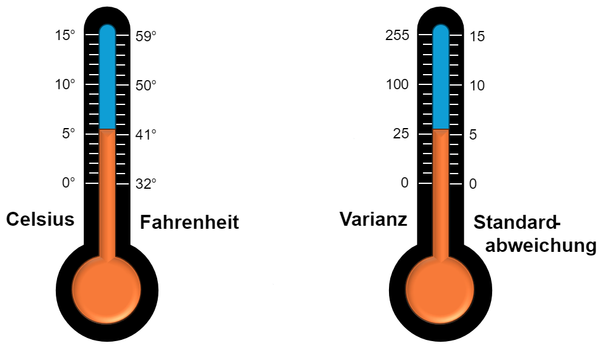

# C.3.0 Mittelwerte

{{ task("tasks/C_3_mode_median_mean/aufgabe.yaml") }}

{{ task("tasks/C_3_2_9_variance_and_std/aufgabe.yaml") }}

!!! formel "Arithmetisches Mittel"

    Sei $X = (x_1, \cdots , x_n)$ ein Datensatz. Dann ist das 
    **arithmetische Mittel** definiert als:
    
    $$
    \bar{x} = \frac{1}{n} \sum_{i=1}^n x_i
    $$

!!! formel "Varianz"

    Sei $X = (x_1, \cdots , x_n)$ ein Datensatz. Dann ist das 
    **Varianz** definiert als:
    
    $$
    \sigma^2 = \frac{1}{n} \sum_{i=1}^n (x_i - \bar{x})^2
    $$

    Die Standardabweichung $\sigma$ ist definiert als die Wurzel der Varianz:

    $$
    \sigma = \sqrt{\sigma^2}
    $$

    [👁‍🗨Visualisierung der Varianz und Standardabweichung](https://websim.ai/p/am27971xh7zp629letvu/8)

Die Varianz ist das arithmetische Mittel, des quadratischen
Abstandes von den Datenpunkten zum arithmetischen Mittel
(bzw. des quadrierten Fehlers).

$$
\sigma^2=\overline{(X - \overline{X})^2}
$$

!!! beispiel 

    Es sei $X = (1,2,3,1.5)$. Dann ist $\bar{X} = 1.875$
    
    Daraus ergibt sich $(X - \bar{X})^2 = (0.765625, 0.015625, 1.265625, 0.140625)$
    
    Berechnen wir davon noch mal das Arithmetische Mittel,
    erhalten wir die Varianz von $X$:
    
    $$
    \sigma^2_X=\overline{(X - \overline{X})^2} = 0.546875
    $$

!!! beispiel

    Mittlere Note: $\bar{x} = 3$.

    Standardabweichung: $\sigma = 0.5$.
    
    Wenn die Noten **normalverteilt** sind, so gilt:
    $\approx 68\%$ der Schüler liegen im Bereich $2.5$ bis $3.5$.
    $\approx 95\%$ der Schüler liegen im Bereich $2$ bis $4$.
    
    [👁‍🗨Visualisrung](https://websim.ai/p/loyi59ezpavi1q6grqf6)
