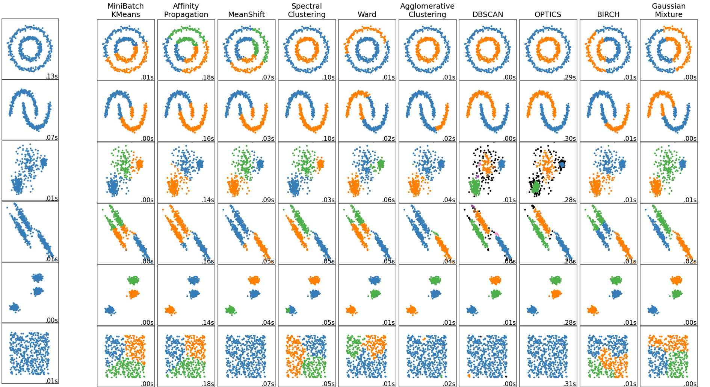

# Einführung Clustering

Das Ziel von Clusteringalgorithmen ist es ein neues Merkmal zu erzeugen, das anzeigt, welche Daten zusammengehören.
Es gibt hier eine ganze Reihe verschiedener Algorithmen, die oben Beispielhaft dargestellt werden 
[(Quelle)](https://scikit-learn.org/stable/auto_examples/cluster/plot_cluster_comparison.html).

Clusteringalgorithmen werden (unglücklicherweise) auch **unsupervised learning** genannt.
