# DBScan

DBScan ist ein Clusteringalgorithmus, der selbstständig eine passende Anzahl von Clustern sucht.
Elemente, die er nicht einem Cluster zuordnen kann, werden als "Ausreißer" markiert.

!!! formel "Algorithmus"

    **Hyperparameter:**

    * 𝑛∈ℕ : die Anzahl der Nachbarn, die ein Punkt braucht, um als Kernpunkt zu gelten.
    * 𝜀∈(0,∞): der Abstand, in dem ein Punkt als Nachbar eines anderen Punktes gilt.
    * Eine Abstandsfunktion 𝑑.

    **Algorithmus:**

    1. Berechnen Sie für jeden Datenpunkt die Anzahl der Nachbarn, die näher als ein bestimmter Grenzwert 𝜀∈(0,∞) liegen.
    2. Markiere alle Punkte mit mindestens 𝑛∈ℕ Neiboren als Kernpunkte.
    3. Wähle einen beliebigen Kernpunkt 𝑝, der nicht Teil eines Clusters ist, und füge ihn zu einem neuen Cluster 𝑐 hinzu.
    4. Füge alle Kernpunkte, die einen maximalen Abstand von 𝜀 zu 𝑝 haben, dem Cluster 𝑐 hinzu.
    5. Wiederholen Sie Schritt 4 für alle neu hinzugefügten Kernpunkte des Clusters.
    6. Wenn es in diesem Cluster keine weiteren Kernpunkte mehr hinzuzufügen gibt, wiederholen Sie Schritt 3. Wenn alle Kernpunkte zu Clustern hinzugefügt wurden, fahren Sie mit Schritt 7 fort.
    7. Für jeden Nicht-Kernpunkt 𝑝^′ wird der nächstgelegene Kernpunkt-Nachbar 𝑝 mit einem maximalen Abstand von 𝜀 gesucht und 𝑝′ zum Cluster von 𝑝 hinzugefügt.
    8. Alle verbleibenden Nicht-Kernpunkte werden dem Ausreißer-Cluster hinzugefügt.


!!! beispiel
    
    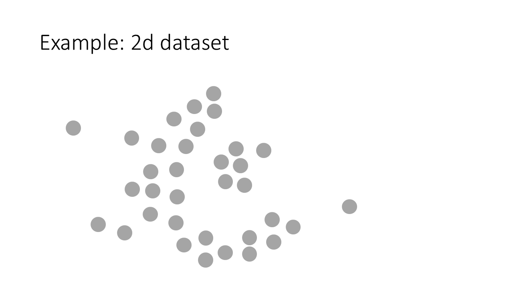
    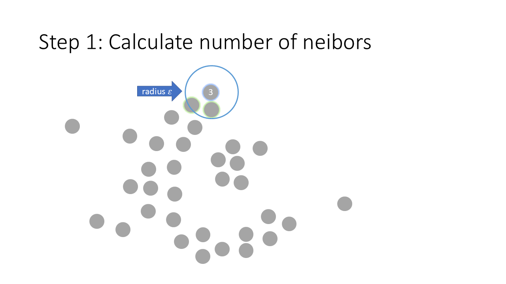
    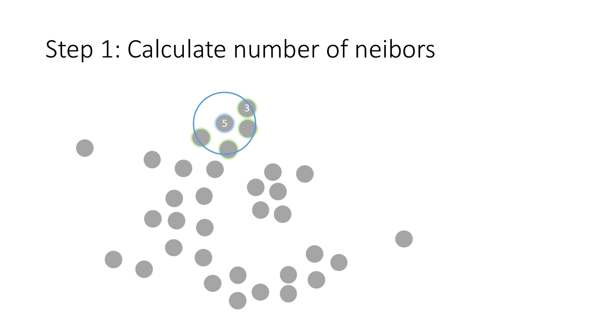
    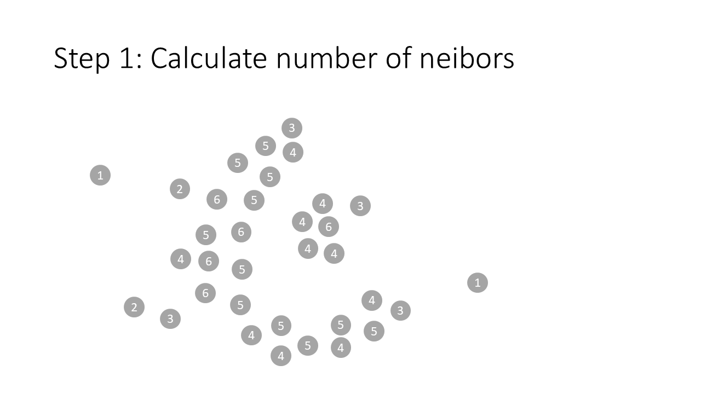
    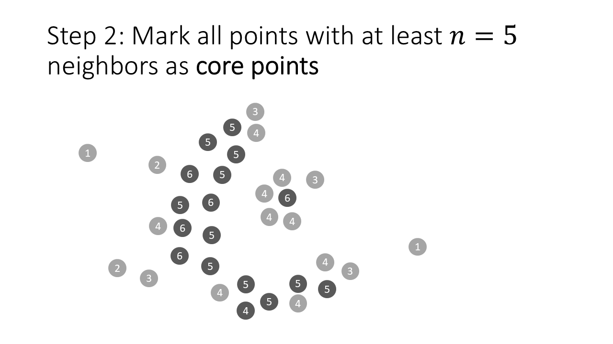
    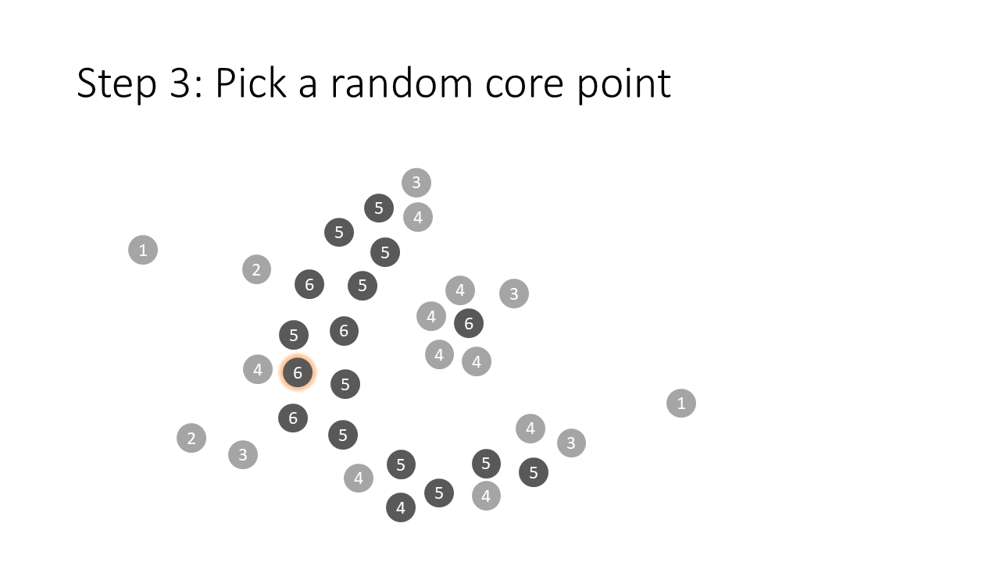
    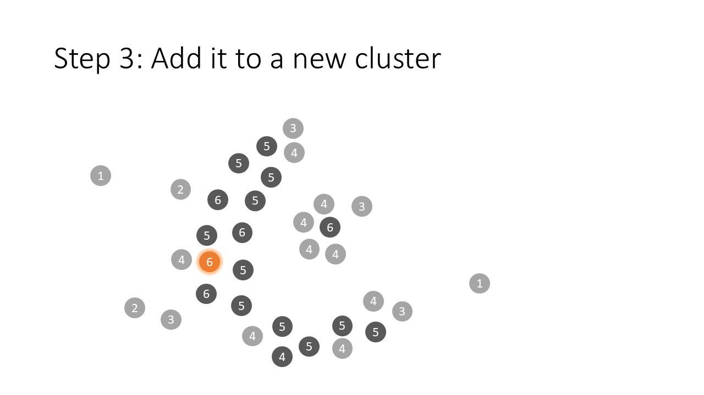
    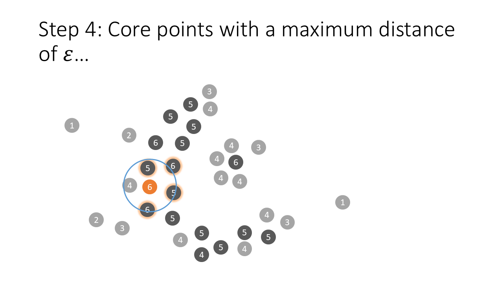
    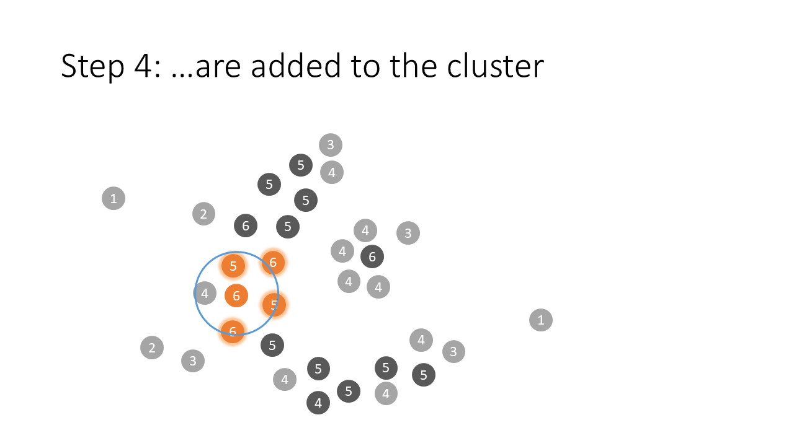
    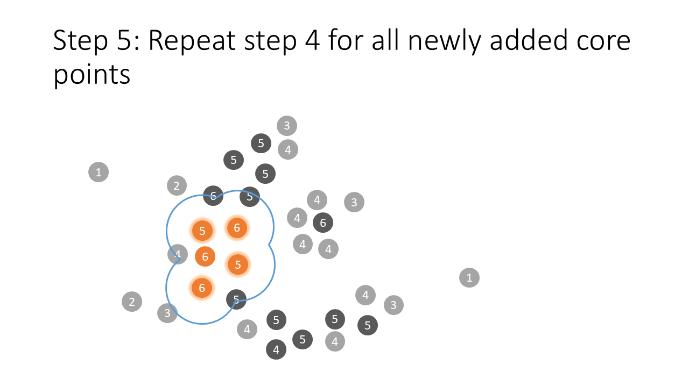
    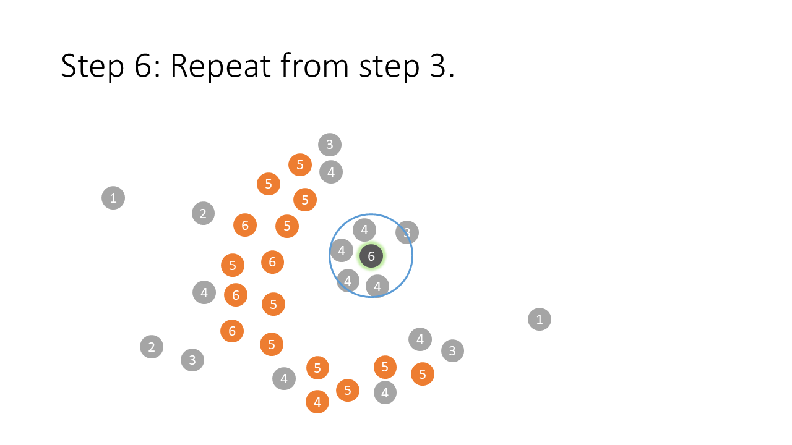
    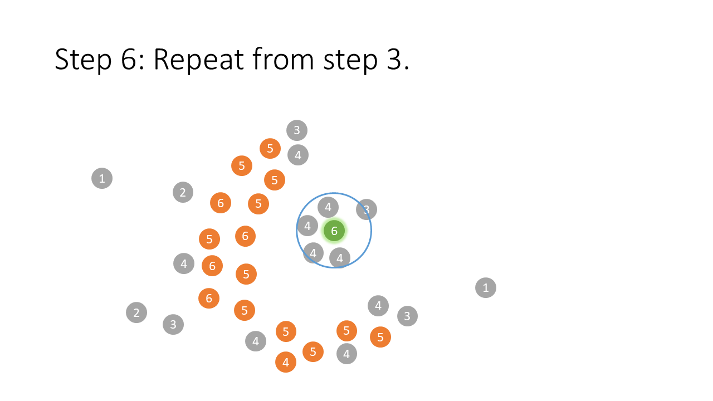
    
    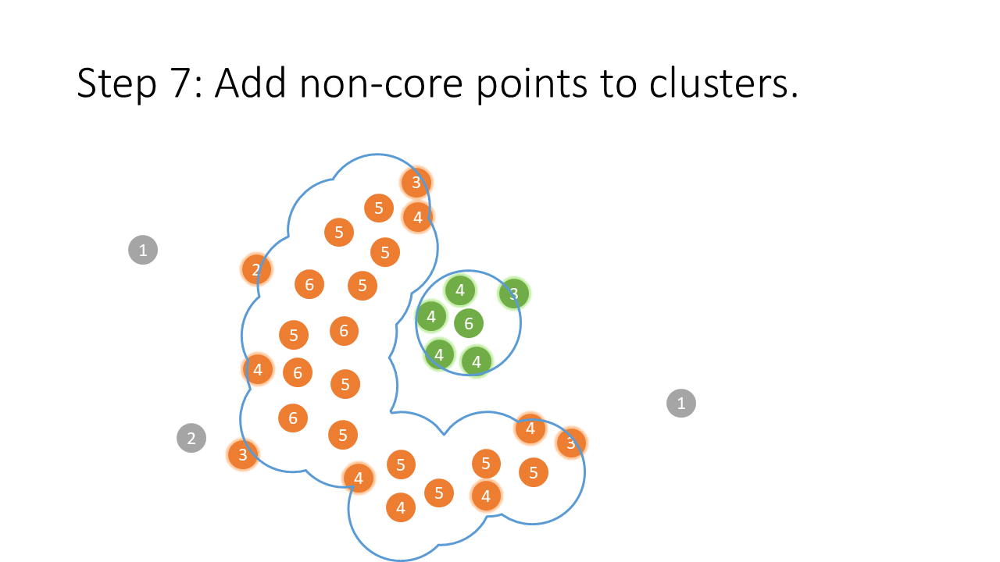
    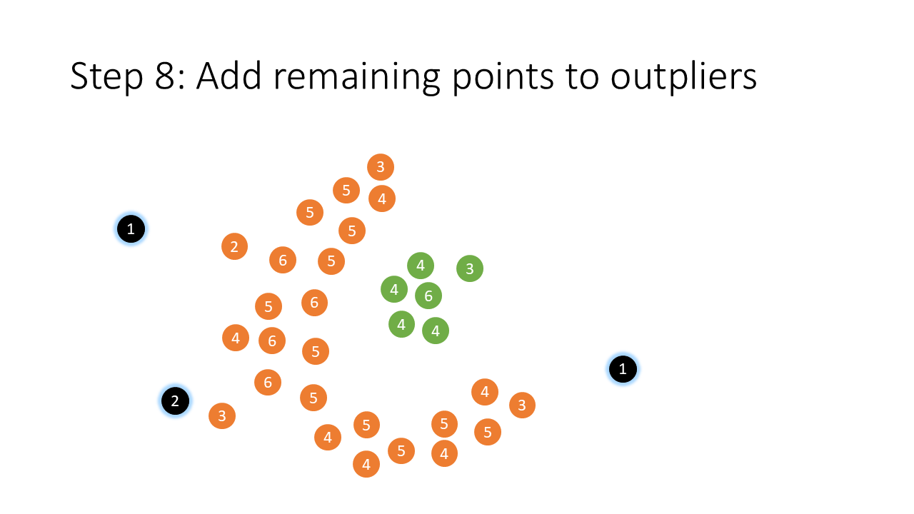


!!! beispiel

    [📙Clustering der Benzin- und Dieselpreise in Indien](https://www.kaggle.com/code/viktorreichert/dbscan-clustering-of-fuel-price-in-india)

    [Download Datensatz](india_fuel_prices_with_locations.csv)

    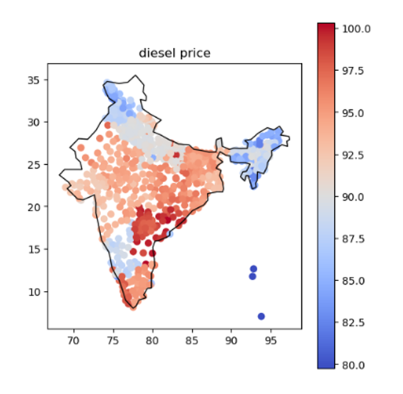

!!! beispiel

    ```python
    import numpy as np
    import matplotlib.pyplot as plt
    from sklearn.cluster import DBSCAN
    from sklearn.datasets import make_blobs
    
    # 1. Künstliche Daten generieren
    X, _ = make_blobs(n_samples=300, centers=[[4, 4], [-2, -1], [1, 1], [10, 4]],
                      cluster_std=0.9, random_state=0)
    
    # 2. DBSCAN-Algorithmus anwenden
    # Parameter:
    # - eps: maximaler Abstand für Nachbarschaft
    # - min_samples: Mindestanzahl von Punkten in der Nachbarschaft für einen Kernpunkt
    dbscan = DBSCAN(eps=0.8, min_samples=10)
    dbscan.fit(X)
    labels = dbscan.labels_
    
    # 3. Anzahl der Cluster ermitteln (Label -1 steht für Rauschen)
    n_clusters = len(set(labels)) - (1 if -1 in labels else 0)
    print("Anzahl Cluster:", n_clusters)
    
    # 4. Ergebnisse visualisieren
    plt.figure(figsize=(8, 6))
    unique_labels = set(labels)
    colors = [plt.cm.Spectral(each)
              for each in np.linspace(0, 1, len(unique_labels))]
    
    for k, col in zip(unique_labels, colors):
        if k == -1:
            # Rauschpunkte (Outlier) in schwarz darstellen
            col = [0, 0, 0, 1]
    
        class_member_mask = (labels == k)
        xy = X[class_member_mask]
        plt.plot(xy[:, 0], xy[:, 1], 'o', markerfacecolor=tuple(col),
                 markeredgecolor='k', markersize=6)
    
    plt.title('DBSCAN Clustering: {} Cluster gefunden'.format(n_clusters))
    plt.xlabel("Feature 1")
    plt.ylabel("Feature 2")
    plt.show()
    ```

    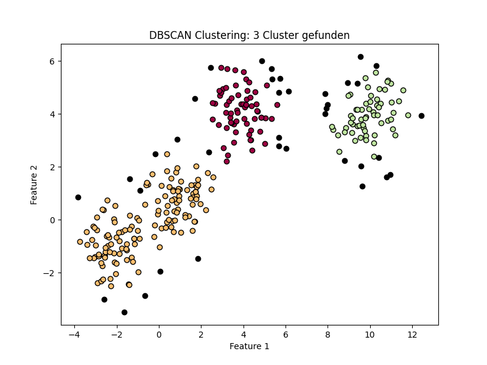

{{ task(
title="DBScan anwenden",
question="""Nutzen Sie DBScan und KMeans, um die Cluster im Indiendatensatz vom obigen Beispiel zu erkennen.

Welcher Algorithmus eignet sich hier besser? Inwiefern kann man den Algorithmus wiederholt anwenden?
""",
) }}

{{ task("tasks/clustering/dbscan.yaml") }}
