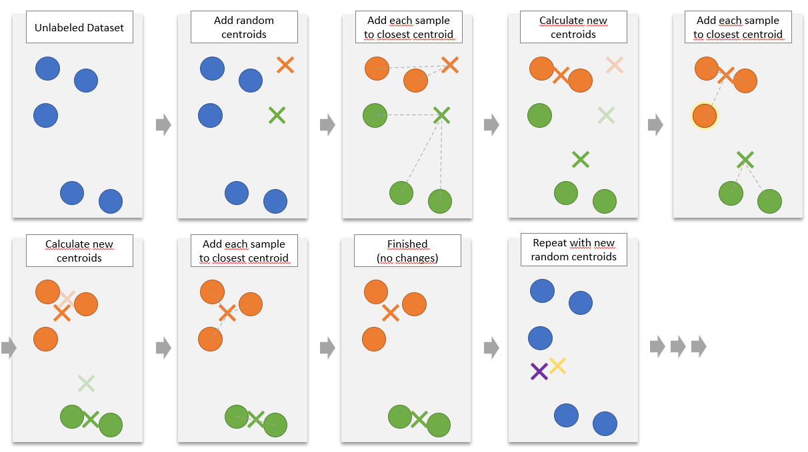
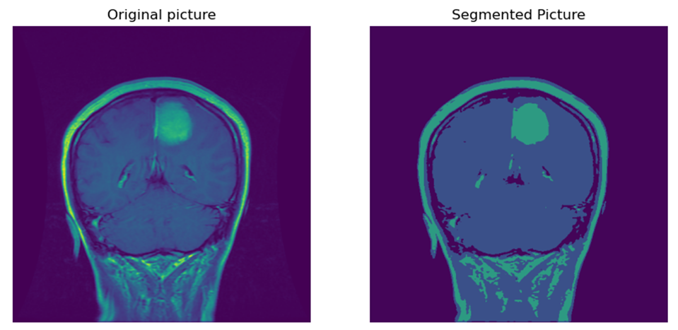

# KMeans

Die Idee beim Clusteringalgorithmus **KMeans** ist es Mittelpunkte von $k$ Clustern über einen iterativen Prozess zu finden.
$k$ ist ein Hyperparameter (wird also im vorhinein vom Nutzer bestimmt).

!!! formel "Algorithmus"

    Gegeben Sei ein Datensatz $X := \{x_1, \cdots, x_n \}$ ein Datensatz mit $n\in \mathbb{N}$ Einträgen.
    Wir suchen $k$ Cluster. Dazu werden **Clustermittelpunkte (Centroide)** $C := \{\mu_1 , \cdots , \mu_k \}$ gesucht.
    Ein Punkt $x\in X$ gehört zu dem Cluster $\mu \in C$, zu dem er den geringsten Abstand hat.
    
    Die Qualität eines Clusterings wird mit der Inertia gemessen:
    
    $$
    \sum_{x\in X}^n \underset{\mu \in C}{min}\text{ }d^{EDQ}(x, \mu)
    $$
    
    Ein Durchlauf des Algorithmus läuft wie folgt ab:

    1. Lege $k$ zufällige Centroide fest.
    2. Bestimme für jeden Eintrag $x\in X$ zu welchem Cluster er gehört (d.h. bestimme den Centroid mit dem geringsten Abstand zu $x$)
    3. Berechne für jedes Cluster den Mittelwert der zugehörigen Einträge. Diese Mittelwerte bilden die neuen Clustermittelpunkte.
    4. Führe Schritte 2 und 3 so lange erneut aus, bis keine Einträge mehr ihre Zugehörigkeit zu einem Cluster ändern oder bis die Reduzierung der Inertia sich nur noch minimal verändert.
    5. Merke dir das Ergebnis und die Inertia und beginne nun erneut bei 1, um ggf. bessere Ergebnisse zu erzielen.
    6. Nach ausreichend vielen Wiederholungen von 1 bis 5 vergleiche die Inertia der Ergebnisse und wähle das Clustering mit der niedrigsten Inertia.

    

!!! beispiel "Bildsegmentierung mit KMeans"

    [📙Kagle Notebook zur Bildsegmentierung mit KMeans](https://www.kaggle.com/viktorreichert/k-means-tumor-image-segmentation)

    
