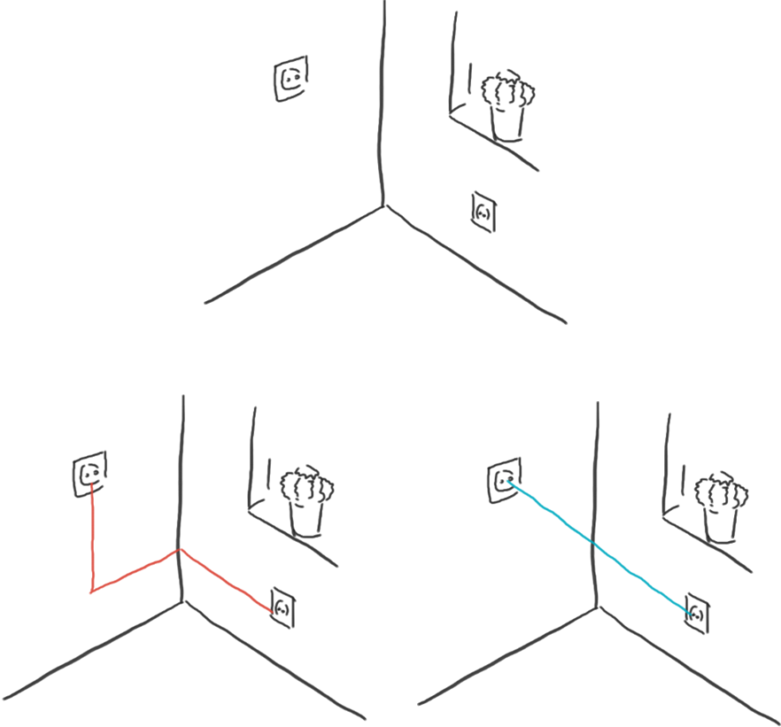
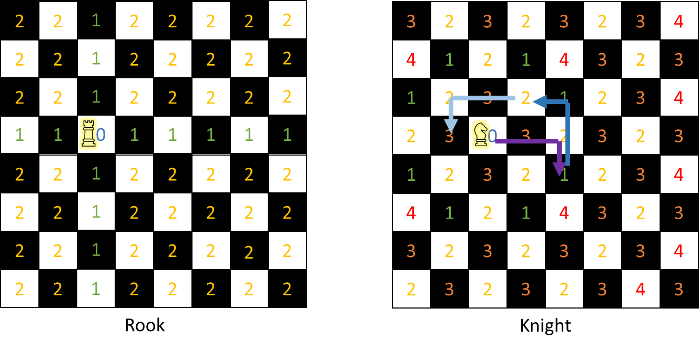
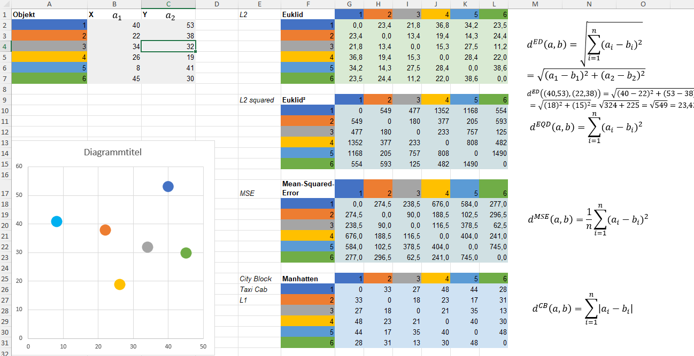

# Abstände

Wann immer wir von „Nachbarn“, „weit“, „nah“ usw. sprechen, beziehen wir uns implizit auf Entfernungen.
Es gibt jedoch eine Vielzahl gültiger Definitionen für Entfernungen.

!!! beispiel

    Wie kann man die Entfernung zwischen zwei Steckdosen berechnen?

    

!!! beispiel

    Für eine Schachfigur kann man die Entfernung zu jedem anderen Feld berechnen, indem man die minimale Anzahl von Zügen zählt, die sie braucht, um dorthin zu gelangen.

    

!!! formel "Definition Distanz"

    Wenn du eine Menge \(M\) von Elementen hast, für die du eine paarweise Distanz definieren möchtest, kannst du das wie folgt tun:  
    Sei \(d: M \times M \rightarrow \mathbb{R}\) eine Funktion. \(d\) definiert genau dann eine Distanz (Metrik) auf \(M\), wenn und nur wenn die folgenden Bedingungen erfüllt sind:
    
    | **Eigenschaft**                                 | **Formel**                                                | **Erklärung**                                                                                                                                                                                   |
    |:-----------------------------------------------:|:----------------------------------------------------------|:------------------------------------------------------------------------------------------------------------------------------------------------------------------------------------------------|
    | **Keine Bewegung nötig**                        | \(\forall x \in M: d(x, x) = 0\)                         | Du musst keine Strecke zurücklegen, wenn du dich nicht vom Ausgangspunkt wegbewegst.                                                                                                            |
    | **Richtungsunabhängig**                         | \(\forall x, y \in M: d(x, y) = d(y, x)\)                 | Die Distanz von \(x\) nach \(y\) ist identisch mit der Distanz von \(y\) nach \(x\).                                                                                                            |
    | **Verschiedene Punkte, verschiedene Orte**      | \(\forall x, y \in M: d(x, y) = 0 \implies x = y\)        | Zwischen zwei unterschiedlichen Punkten muss immer ein positiver Abstand bestehen.                                                                                                               |
    | **Keine Abkürzungen erlaubt**                   | \(\forall x, y, z \in M: d(x, y) \le d(x, z) + d(z, y)\)  | \(d\) beschreibt die Länge des kürzesten Weges zwischen zwei Elementen. \((d(x,z) + d(z,y))\) steht für eine Route über \(z\). Die Summe dieser Abstände ist nicht kürzer als der direkte Weg.  |

    
!!! tip "Excel"

    [📗Download Excelsheet](Distanzen.xlsx) mit verschiedenen Distanzmatrizen

    