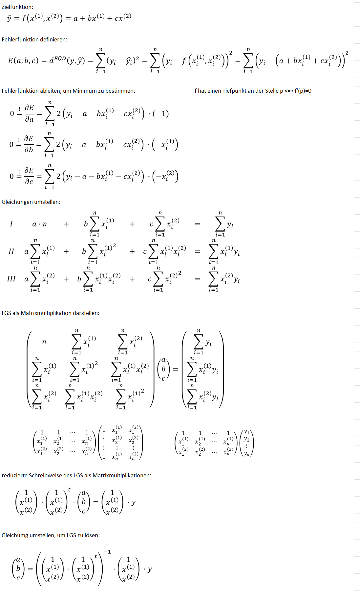

# D.3 Regressionsrechnung

!!! question "Regression händisch berechnen"
    
    Übungsaufgaben zum schriftlichen Berechnen der Regression:
    [1](https://mathehilfe24.de/wp-content/uploads/2013/11/%C3%9Cbungsaufgabe-1-zur-linearen-Regression.pdf)
    [2](https://esb1jockisch.lima-city.de/math/math11/regression2/kap_4_1_2_aufgaben.pdf)

{{ task("tasks/D_3_Regression/aufgabe.yaml") }}

{{ task("tasks/D_3_2_10_herleitung_regression/aufgabe.yaml") }}

## Schritweise Herleitung der Regressionsgeraden

### Lineare Funktion

Es solle eine lineare Funktion aufgestellt werden, welche die folgende Form hat:

$$
y = f(x) = a + b\cdot x
$$

$a$ ist der Schnitt mit der $y$-Achse mit der Geraden und $b$ die Steigung der Gerade.

### Datensatz

Es liegt ein Datensatz von $X = (x_1, \cdots , x_n)$ und $Y = (y_1, \cdots, y_n)$ Werten vor.
$X$ ist die **unabhängige Variable** und aus dieser soll
$Y$ hergeleitet werden, welche deswegen **abhängige Variable** heißt.

### Regressionsgerade

Da es zwischen $X$ und $Y$, keinen perfekten linearen Zusammenhang
gibt, wird jede Funktion, die wir aufstellen, fehlerbehaftet sein.

Wenn wir also $a$ und $b$ wählen und damit eine Regressionsgerade
$f(x) = a + b\cdot x$ aufstellen, so berechnet diese nicht direkt
die $y$-Werte, sondern nur (hoffentlich gute) Annäherungen.

Daher nenen wir das Ergebnis von $f(x)$ auch oft $\hat{y}$.

Wir wollen also versuchen den Unterschied von $y$ und $\hat{y}$
zu minieren. Nicht nur, dass, wir wollen sogar, das Quadrat
dieses Unterschiedes minimieren, also 

$$
\text{minimiere } (y - \hat{y})^2
$$

Da wir aber in $Y =  (y_1, \cdots, y_n)$ sehr viele $y$'s haben,
wollen wir die Summe all dieser Unterschiede minimieren:

$$
\text{minimiere } \sum_{i=1}^n (y_i - \hat{y_i})^2
$$

### Fehlerfunktion aufstellen

Wir nennen diese Summe $E$ und lösen Sie im folgenden auf, um
die Abhängigkeit von $a$ und $b$ deutlich zu machen:

$$
E = \sum_{i=1}^n (y_i - \hat{y_i})^2 = \sum_{i=1}^n (y_i - f(x_i))^2 = \sum_{i=1}^n (y_i - (a + b\cdot x_i))^2 =\sum_{i=1}^n (y_i - a - b\cdot x_i)^2  
$$

Da $a$ und $b$, als einzige von uns frei wählbar sind
und die $x$- und $y$-Werte von Vornherein festgelegt sind,
können wir $E$ als eine Funktion betrachten, die von $a$ und $b$
abhängig ist.

$$
E(a,b) =\sum_{i=1}^n (y_i - a - b\cdot x_i)^2  
$$

### Fehlerfunktion minimieren

Wir suchen nun die $a$ und $b$, sodas $E(a,b)$ minimal wird.

Theoretisch wollen wir die Ableitung bilden und sie gleich $0$
setzen:

$$
E' = 0
$$

Da $E(a,b)$, jedoch von zwei Variablen abhängt, müssen wir hier
die beiden partiellen Ableitungen bilden:

$$
E'_a = \frac{\partial E(a, b)}{\partial a}  \text{ und }
E'_b = \frac{\partial E(a, b)}{\partial b}
$$

### Fehlerfunktion ableiten

$$
E(a,b) =\sum_{i=1}^n (y_i - a - b\cdot x_i)^2  
$$

Um die Fehlerfunktion ableiten, betrachten wir erstmal nur die 
Summanden:

$$
(y_i - a - b\cdot x_i)^2
$$

Die $x_i$ und $y_i$ können wir als feste Zahlen betrachten.

Leiten wir den Ausdruck zunächst nach $a$ ab:

$$
\frac{\partial }{\partial a}  (y_i - a - b\cdot x_i)^2 = 2 (a - y_i +b\cdot x_i)
$$

Dann leiten wir den Summanden auch noch nach $b$ ab:

$$
\frac{\partial }{\partial b}  (y_i - a - b\cdot x_i)^2 = 2x (x_i b - y_i + a)
$$

$E(a,b)$  ist eine Summe:

$$
E(a,b) =\sum_{i=1}^n (y_i - a - b\cdot x_i)^2 = (y_1 - a - b\cdot x_1)^2 + (y_2 - a - b\cdot x_2)^2 + \cdots +  (y_n - a - b\cdot x_n)^2  
$$

Wenn wir eine Summe ableiten, sagen uns die Rechenregeln, dass
wir jeden Summanden einzeln ableiten und die Ergebnisse summieren:

$$
\frac{\partial E(a, b)}{\partial a} = \frac{\partial }{\partial a}(y_1 - a - b\cdot x_1)^2 + \frac{\partial }{\partial a}(y_2 - a - b\cdot x_2)^2 + \cdots + \frac{\partial }{\partial a}(y_n - a - b\cdot x_n)^2
$$

also:

$$
\frac{\partial E(a, b)}{\partial a} = 2(a-y_1 + b \cdot x_1) + 2(a-y_2 + b \cdot x_2) + \cdots + 2(a-y_n + b \cdot x_n)
$$

Wir schreiben das kompakt mit dem Summenzeichen als:

$$
\frac{\partial E(a, b)}{\partial a} = \sum_{i=1}^n 2(a-y_i + b \cdot x_i) 
$$

Analog, lässt sich alles mit $b$ durchführen:

$$
\frac{\partial E(a, b)}{\partial b} = \sum_{i=1}^n 2x_i(a-y_i + b \cdot x_i) 
$$

### Ableitungen gleich 0 setzen

Wir setzen nun die Ableitungen gleich $0$

$$
0 = \frac{\partial E(a, b)}{\partial a} = \sum_{i=1}^n 2(a-y_i + b \cdot x_i) = 2 \sum_{i=1}^n (a-y_i + b \cdot x_i)
$$

$$
0 = \frac{\partial E(a, b)}{\partial b} = \sum_{i=1}^n 2x_i(a-y_i + b \cdot x_i) = 2 \sum_{i=1}^n (ax_i-y_i x_i + b \cdot x_i^2)
$$

Ich kann auf beiden Seiten der Gleichung durch $2$ teilen:

$$
0 =  \sum_{i=1}^n (a-y_i + b \cdot x_i) 
$$

$$
0 =  \sum_{i=1}^n (ax_i-y_i x_i + b \cdot x_i^2)
$$

Wir errinnern uns, wie man ein Summenzeichen auf die 
einzelnen Summanden aufteilt:

\[
\begin{align}
\sum_{i=1}^n (x_i + y_i) &= (x_1 + y_1) + (x_2 + y_2) + \cdots + (x_n + y_n) \\
&= (x_1 + x_2 + \cdots + x_n) + (y_1 + y_2 + \cdots + y_n) \\
&= \sum_{i=1}^n x_i + \sum_{i=1}^n y_i
\end{align}
\]

Wir verteilen nun die Summenzeichen:

$$
0 =  \sum_{i=1}^n (a-y_i + b \cdot x_i) = \sum_{i=1}^n a \cdot 1 - \sum_{i=1}^n y_i + \sum_{i=1}^n b\cdot x_i  = a \sum_{i=1}^n 1 - \sum_{i=1}^n y_i + b \sum_{i=1}^n x_i 
$$

$$
0 =  \sum_{i=1}^n (ax_i-y_i x_i + b \cdot x_i^2) = \sum_{i=1}^n ax_i - \sum_{i=1}^n y_i x_i + \sum_{i=1}^n b\cdot x_i^2 = a\sum_{i=1}^n x_i - \sum_{i=1}^n y_i x_i + b\sum_{i=1}^n  x_i^2
$$

Es gilt 

$$
\sum_{i=1}^5 1 = 1+ 1+1+1+1 = 5\cdot 1 = 5
$$

also allgemein: 

$$
\sum_{i=1}^n 1 = (1+\cdots +1) = n \cdots 1 = n
$$

Also können wir auch noch eine Summe kürzer notieren als:

$$
a\sum_{i=1}^n 1 = n\cdot a
$$

### Gleichungen ordnen

Ordnen wir nun die Gleichungen nach den $y_i$, $a$ und $b$:

$$
\begin{matrix}
-\sum_{i=1}^n y_i &+& an &+& b \sum_{i=1}^n x_i &=& 0 \\
-\sum_{i=1}^n y_i x_i &+& a \sum_{i=1}^n x_i &+& b \sum_{i=1}^n x_i^2 &=& 0
\end{matrix}
$$

Wir verschieben die $y$-Summanden nach rechts:

$$
\begin{matrix}
an &+& b \sum_{i=1}^n x_i &=& \sum_{i=1}^n y_i \\
a \sum_{i=1}^n x_i &+& b \sum_{i=1}^n x_i^2 &=& \sum_{i=1}^n y_i x_i
\end{matrix}
$$

### Gleichung im Matrix verwandeln

$$
\begin{matrix}
a R &+& b T &=& U \\
a V &+& b W &=& Z
\end{matrix}
$$

Wir können das als Matrixmulitpliktion wie folgt notieren:

\[
\begin{pmatrix}
Ra + Tb \\
Va + Wb
\end{pmatrix}
=
\begin{pmatrix}
R & T \\
V & W
\end{pmatrix}
\begin{pmatrix}
a \\
b
\end{pmatrix}
=
\begin{pmatrix}
U \\
Z
\end{pmatrix}
\]

Wir können nun $R, S, T, U, V, W, Z$ wieder auflösen:

\[
\begin{pmatrix}
n & \sum_{i=1}^n x_i \\
\sum_{i=1}^n x_i & \sum_{i=1}^n x_i^2
\end{pmatrix}
\begin{pmatrix}
a \\
b
\end{pmatrix}
=
\begin{pmatrix}
\sum_{i=1}^n y_i \\
\sum_{i=1}^n y_i x_i
\end{pmatrix}
\]

### Summenzeichen in Matrixoperationen verwandeln

Gegeben sind ja $X = (x_1 \cdots x_n) \in \mathbb{R}^{1\times n}$ und $Y = (y_1 \cdots y_n) \in \mathbb{R}^{1\times n}$.

Wie kann $\sum_{i=1}^n x_i y_i$ als Multiplikation der beiden Matrizen / Vektoren notiert werden?

$$ 
x_1\cdot y_1 + x_2 \cdot y_2 + \cdots + x_n \cdot y_n =
(x_1 \cdots x_n) \cdot 
\begin{pmatrix}
y_1\\
\cdots\\
y_n
\end{pmatrix}
= (x_1 \cdots x_n) \cdot (y_1 \cdots y_n)^T 
= XY^T 
= \sum_{i=1}^n x_i y_i
$$

bzw.:

$$
(y_1 \cdots y_n) \cdot 
\begin{pmatrix}
x_1\\
\cdots\\
x_n
\end{pmatrix}
= Y X^T = \sum_{i=1}^n y_i x_i
$$

Wir können dies auch für die anderen summen tun:

$$
\sum_{i=1}^n x_i^2 = \sum_{i=1}^n x_i \cdot x_i = XX^T
$$

Sei $\mathbb{1} = (1 \cdots 1) \in \mathbb{R}^{1\times n}$

$$
\sum_{i=1}^n x_i = \sum_{i=1}^n 1 \cdot x_i = (1 \cdots 1) \cdot 
\begin{pmatrix}
x_1\\
\cdots\\
x_n
\end{pmatrix}
= \mathbb{1} X^T
= X \mathbb{1}^T
$$

$$
\sum_{i=1}^n y_i 
= \mathbb{1} Y^T
= Y \mathbb{1}^T
$$

$$
n = \sum_{i=1}^n 1 = \sum_{i=1}^n 1 \cdot 1 = \mathbb{1} \cdot \mathbb{1}^T
$$

### Summen zu Matrixmultiplikationen umschreiben

\[
\begin{pmatrix}
n & \sum_{i=1}^n x_i \\
\sum_{i=1}^n x_i & \sum_{i=1}^n x_i^2
\end{pmatrix}
\begin{pmatrix}
a \\
b
\end{pmatrix}
=
\begin{pmatrix}
\sum_{i=1}^n y_i \\
\sum_{i=1}^n y_i x_i
\end{pmatrix}
\]

\[
\begin{pmatrix}
\mathbb{1} \cdot \mathbb{1}^T & \mathbb{1} \cdot X^T \\
X \cdot \mathbb{1}^T          & X \cdot X^T
\end{pmatrix}
\begin{pmatrix}
a \\
b
\end{pmatrix}
=
\begin{pmatrix}
\mathbb{1} \cdot Y^T \\
X \cdot Y^T
\end{pmatrix}
\]

Es seien $r = \mathbb{1}, s = \mathbb{1}^T, t = X^T, u = X$. Dann ist:

\[
\begin{pmatrix}
r \cdot s & r \cdot t \\
u \cdot s & u \cdot t
\end{pmatrix}
=
\begin{pmatrix}
r\\
u
\end{pmatrix}
\begin{pmatrix}
s&t
\end{pmatrix}
\]

Wir können also oben wieder vereinfachen:

\[
\begin{pmatrix}
\mathbb{1}\\
X
\end{pmatrix}
\begin{pmatrix}
\mathbb{1}^T & X^T
\end{pmatrix}
\begin{pmatrix}
a \\
b
\end{pmatrix}
=
\begin{pmatrix}
\mathbb{1} \cdot \mathbb{1}^T & \mathbb{1} \cdot X^T \\
X \cdot \mathbb{1}^T          & X \cdot X^T
\end{pmatrix}
\begin{pmatrix}
a \\
b
\end{pmatrix}
=
\begin{pmatrix}
\mathbb{1} \cdot Y^T \\
X \cdot Y^T
\end{pmatrix}
=
\begin{pmatrix}
\mathbb{1}  \\
X
\end{pmatrix}
\cdot
Y^T
\]

Wir können die rechte Seite schreiben als:

\[
\begin{pmatrix}
\mathbb{1}  \\
X
\end{pmatrix}
\cdot
Y^T
=
\begin{pmatrix}
1 & \cdots & 1  \\
x_1 & \cdots & x_n
\end{pmatrix}
\cdot
\begin{pmatrix}
y_1 \\
\vdots \\
y_n
\end{pmatrix}
\]

und die linke Seite wie folgt

\[
\begin{pmatrix}
\mathbb{1}\\
X
\end{pmatrix}
\begin{pmatrix}
\mathbb{1}^T & X^T
\end{pmatrix}
\begin{pmatrix}
a \\
b
\end{pmatrix}
=
\begin{pmatrix}
1 & \cdots & 1  \\
x_1 & \cdots & x_n
\end{pmatrix}
\begin{pmatrix}
1  & x_1\\
\vdots & \vdots \\
1 & x_n
\end{pmatrix}
\begin{pmatrix}
a \\
b
\end{pmatrix}
=
\begin{pmatrix}
\mathbb{1}\\
X
\end{pmatrix}
\begin{pmatrix}
\mathbb{1}\\
X
\end{pmatrix}^T
\begin{pmatrix}
a\\
b
\end{pmatrix}
\]

Also insgesamt:

\[
\begin{pmatrix}
\mathbb{1}\\
X
\end{pmatrix}
\begin{pmatrix}
\mathbb{1}\\
X
\end{pmatrix}^T
\begin{pmatrix}
a\\
b
\end{pmatrix}
=
\begin{pmatrix}
\mathbb{1}  \\
X
\end{pmatrix}
\cdot
Y^T
\]

\[
\begin{pmatrix}
a\\
b
\end{pmatrix}
=
\left(
\begin{pmatrix}
\mathbb{1}\\
X
\end{pmatrix}
\begin{pmatrix}
\mathbb{1}\\
X
\end{pmatrix}^T
\right)^{-1}
\begin{pmatrix}
\mathbb{1}\\
X
\end{pmatrix}
\begin{pmatrix}
\mathbb{1}\\
X
\end{pmatrix}^T
\begin{pmatrix}
a\\
b
\end{pmatrix}
=
\left(
\begin{pmatrix}
\mathbb{1}\\
X
\end{pmatrix}
\begin{pmatrix}
\mathbb{1}\\
X
\end{pmatrix}^T
\right)^{-1}
\begin{pmatrix}
\mathbb{1}  \\
X
\end{pmatrix}
\cdot
Y^T
\]

\[
\begin{pmatrix}
a\\
b
\end{pmatrix}
=
\left(
\begin{pmatrix}
\mathbb{1}\\
X
\end{pmatrix}
\begin{pmatrix}
\mathbb{1}\\
X
\end{pmatrix}^T
\right)^{-1}
\begin{pmatrix}
\mathbb{1}  \\
X
\end{pmatrix}
\cdot
Y^T
\]

{{ task("tasks/D_3_3_multiple_regression/aufgabe.yaml") }}

