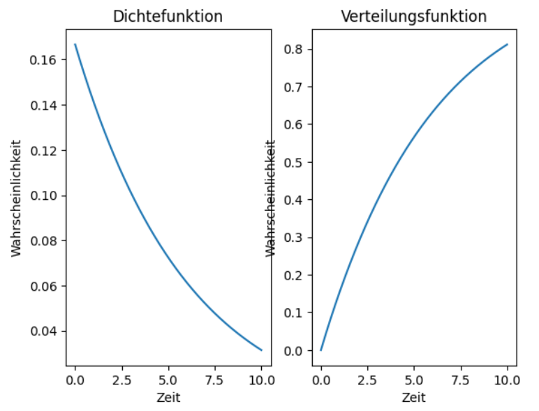

# Exponentialverteilung

## Was ist das für eine Verteilung und wozu dient sie?

Die Exponentialverteilung ist eine spezielle Wahrscheinlichkeitsverteilung, die in der Statistik verwendet wird. Sie beschreibt, wie lange es im Durchschnitt dauert, bis ein bestimmtes zufälliges Ereignis, das **erste Mal** eintritt.

- Sie ist **gedächtnislos**, was bedeutet, dass es keinen unterschied macht, wie lange man auf ein Ereignis wartet. Die Wahrscheinlichkeit, dass es Eintritt ist zu jedem Zeitpunkt gleich. Die Warscheinlichkeit hängt also nur davon ab, wie lange man noch darauf warten muss, und nicht davon, wie lange man schon gewartet hat.
- Der Wert ist immer $\geq 0$ (es gibt keine negativen Zeiten).

!!! warning Wichtig
    Die Exponentialverteilung ist ein **theoretisches Modell**, das in der Praxis oft verwendet wird, um Prozesse zu vereinfachen. Tatsächliche Ereignisse können von dieser Verteilung abweichen, da reale Daten häufig nicht exakt der Exponentialverteilung folgen. Dennoch ist sie nützlich, weil sie mathematisch leicht handhabbar ist und grundlegende Einblicke liefert.

!!! formel "Dichtefunktion"

    Die Dichtefunktion, gibt die Wahrscheinlichkeitsdichte an, dass das Ereignis nach einer Zeit $x$ eintritt.
    
    $$f(x; \lambda) = \begin{cases}
    \lambda e^{-\lambda x}, & x \geq 0 \\
    0, & sonst
    \end{cases}$$
    
    Für $x < 0$ gilt $f(x) = 0$, da negative Zeiten keinen Sinn ergeben.

!!! formel "Verteilungsfunktion"

    Die Dichtefunktion gibt die Wahrscheinlichkeitsdichte dafür an, dass das Ereignis nach einer Zeit $x$ eintritt:
    
    $$F(x; \lambda) = \begin{cases}
    1 - e^{-\lambda x}, & x \geq 0 \\
    0, & sonst
    \end{cases}$$

    **$\lambda$:** Kehrwert der durchschnittlichen Zeit bis zum Ereignis

    **$e$:** Die Eulersche Zahl ($\approx 2{,}71828$).

!!! beispiel
    
    Tritt ein Ereignis im Mittel einmal alle 5 Minuten ein, dann ist $\lambda = \frac{1}{5} = 0{,}2$.

!!! formel "Erwartungswert"
    
    Wie lange muss man durchschnittlich warten, bis das Ereignis auftritt:

    $$\mathbb{E}(X) = \frac{1}{\lambda}$$

    Tritt ein Ereignis im Durchschnitt $\lambda$-mal pro Einheit auf, dann dauert es im Mittel $\frac{1}{\lambda}$ Einheiten, bis es eintritt.

!!! formel "Varianz"

    Sie misst, wie stark die Wartezeiten um den Erwartungswert streuen

    $$Var(X) = \frac{1}{\lambda^2}$$


Eine größere Rate $\lambda$ führt dazu, dass die Varianz kleiner wird, da die Streuung bei häufigeren Ereignissen kleiner ist.

<iframe src="https://websim.ai/p/h7sps6_itzxqn7qm76_h/1" width="100%" height="610" style="border:none;"></iframe>

!!! beispiele "Anwendungsbereiche"
    
    Man verwendet die Exponentialverteilung, wenn ...
    
    - Wie lange ein Gerät funktioniert, bevor es kaputtgeht.
    - Radioaktiver Zerfall
    - Zeit zwischen zwei Anrufen(im Callcenter)


!!! beispiel "Beispiel: Wartezeit an einer Kasse"
   
    An einer Supermarktkasse dauert es im Durchschnitt **3 Minuten**, bis ein Kunde fertig bedient wird.

    **Fragen:**
    
    Wie groß ist die Wahrscheinlichkeit, dass die Bedienung eines Kunden **weniger als 2 Minuten** dauert?
    
    Wie groß ist die Wahrscheinlichkeit, dass die Bedienung eines Kunden **länger als 4 Minuten** dauert?

    **Gegebene Werte:**

    Durchschnittliche Wartezeit: $E(X) = 3$ Minuten
   
    Parameter der Exponentialverteilung:
   
    $$\lambda = \frac{1}{E(X)} = \frac{1}{3} \approx 0{,}333$$


    **Formeln:**
   
    **Verteilungsfunktion für P(X <= x) :**

    $$P(X \leq x) = F(x) = 1 - e^{-\lambda x}$$

    **Gegenwahrscheinlichkeit für P(X > x) :**

    $$P(X > x) = 1 - F(x) = e^{-\lambda x}$$


    **Rechnungen:**

    _Wahrscheinlichkeit für weniger als 2 Minuten:_

    $$P(X \leq 2) = 1 - e^{-\lambda \cdot 2} = 1 - e^{-0{,}333 \cdot 2}$$
   
    $$P(X \leq 2) = 1 - e^{-0{,}666} \approx 1 - 0{,}514 \approx 0{,}486$$

    *Ergebnis:* Die Wahrscheinlichkeit, dass die Bedienung weniger als 2 Minuten dauert, beträgt etwa **48,6 %**.


    _Wahrscheinlichkeit für mehr als 4 Minuten:_

    $$P(X > 4) = e^{-\lambda \cdot 4} = e^{-0{,}333 \cdot 4}$$

    $$P(X > 4) = e^{-1{,}332} \approx 0{,}264$$

    *Ergebnis:* Die Wahrscheinlichkeit, dass die Bedienung länger als 4 Minuten dauert, beträgt etwa **26,4 %**.

    **Zusammenfassung:**
   
    $$P(X \leq 2) \approx 48{,}6\,\%$$
    
    $$P(X > 4) \approx 26{,}4\,\%$$


## Rechenaufgaben/MC-Fragen/Freitext-Aufgaben/Wissenfragen erstellen.

{{ task(
title="Aufgabe 1",
question="""Die tägliche **Ausfallrate** ist laut Hersteller \(\lambda = 0{,}001\).

1. Wie ist die durchschnittliche Zeit bis ein Handy nicht mehr funktioniert
2. Wie hoch ist die Wahrscheinlichkeit, dass dein Handy nach einem Jahr noch funktioniert ?
""",
solution="""
**Erwartungswert**: \(E(X) = \\frac{1}{\lambda} = \\frac{1}{0{,}001} = 1000\)

**Antwort 1:**
Sie durchschnittliche Zeit bis ein Handy nicht mehr funktioniert sind **1000 Tage**


$$F(x;\lambda) = F(365;0,001) = 1-e^{−λ⋅t} = 1-e^{−0,001⋅365} ≈ 0,306$$

**Antwort 2:**
Nach 365 Tagen sind 30,6% aller Geräte ausgefallen.
Die Wahrscheinlichkeit, dass unser Gerät nach 365 Tagen noch funktionieren wird, liegt also bei 69,4%.""",
)
}}


{{ task(
title="Aufgabe 2",
question="""Nach 400 Tagen sind 3% der Computer defekt. Bestimme $\lambda$.""",
solution="""
$$F(400) = 0,03$$
In die Verteilungsfunktion Eingesetzt:

$$0,03 = 1 - e^{\lambda * 400}$$

Nach $\lambda$ auflösen:

Exponentialausdruck isolieren:

$$e^{\lambda*400} = 1 - 0,03 = 0,97$$

Natürlichen logarithmus auf beiden Seiten anwenden:

$$-\lambda * 400 = ln(0,97)$$

ln(0,97) berechnen:

$$ln(0,97) ≈ -0,03046$$

Eingesetzt in die Gleichung:

$$-\lambda * 400 = -0,03046$$

Zum Schluss nach $\lambda$ auflösen:

$$\lambda = \frac{0,03046}{400}$$

$$\lambda ≈ 0,00007615$$

**Antwort:** Der Wert von $\lambda$ beträgt etwa 0,00007615 pro Tag.
""",
) }}


## Multiple Choice Aufgaben

{{ task(
title="MC-Frage 1",
question="""Ein Gerät hat eine mittlere Haltbarkeit von 5 Jahren. Mit welcher Wahrscheinlichkeit ist ein Gerät 5 Jahre nach Anschaffung noch gut?

A) 37%

B) 50%

C) 63%

D) keine dieser Antworten""",
solution="A",
) }}

{{ task(
title="MC-Frage 2",
question="""Welche Verteilungsfunktion gehört zum größeren Lambda?


A) die Helle

B) die Dunkle

C) Die Linien haben das gleiche Lambda

D) Das kann man so nicht beurteilen
""",
solution="B",
) }}


## Programmierung

```python
import matplotlib.pyplot as plt
import numpy as np

x = np.linspace(0, 10, 1000)
lmbda = 1/6

dichtefunktion = lmbda * np.exp(-lmbda * x)
verteilungsfunktion = 1 - np.exp(-lmbda * x)

plt.figure()

plt.subplot(1,2,1)
plt.plot(x, dichtefunktion)
plt.title("Dichtefunktion")
plt.xlabel("Zeit")
plt.ylabel("Wahrscheinlichkeit")

plt.subplot(1,2,2)
plt.plot(x, verteilungsfunktion)
plt.title("Verteilungsfunktion")
plt.xlabel("Zeit")
plt.ylabel("Wahrscheinlichkeit")

plt.show()
```



- Numpy wurde hier verwendet, um einen gleichmäßigen Wertebreich zu erstellen, und um die Exponentialberechnungen durchzuführen
- Matplotlib.pyplot wurde zum Visualisieren verwendet.
