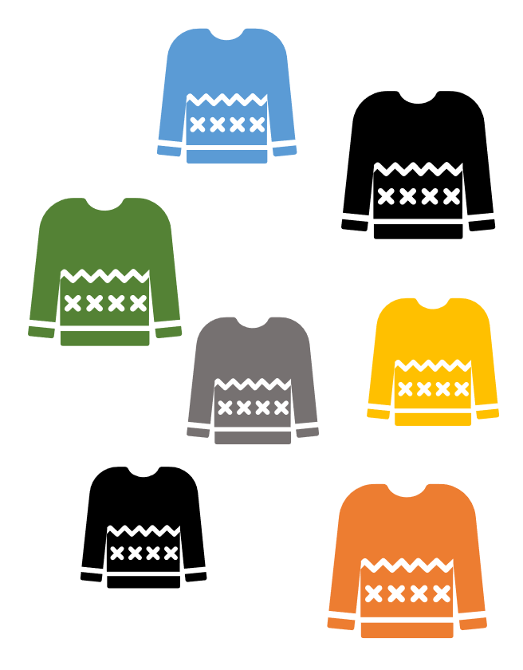
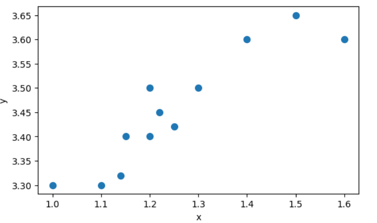
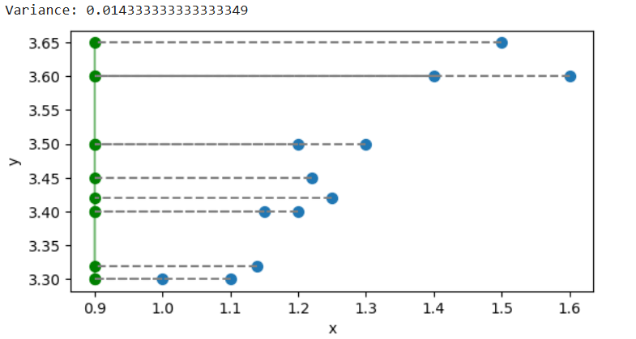
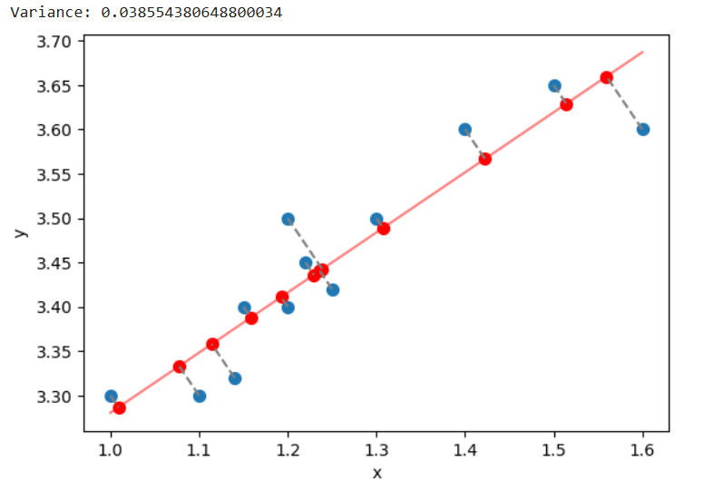
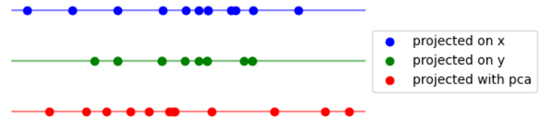
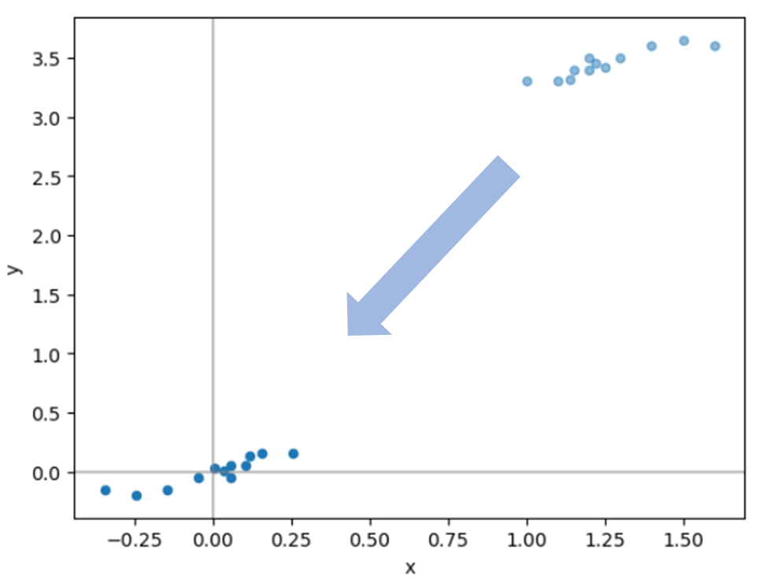
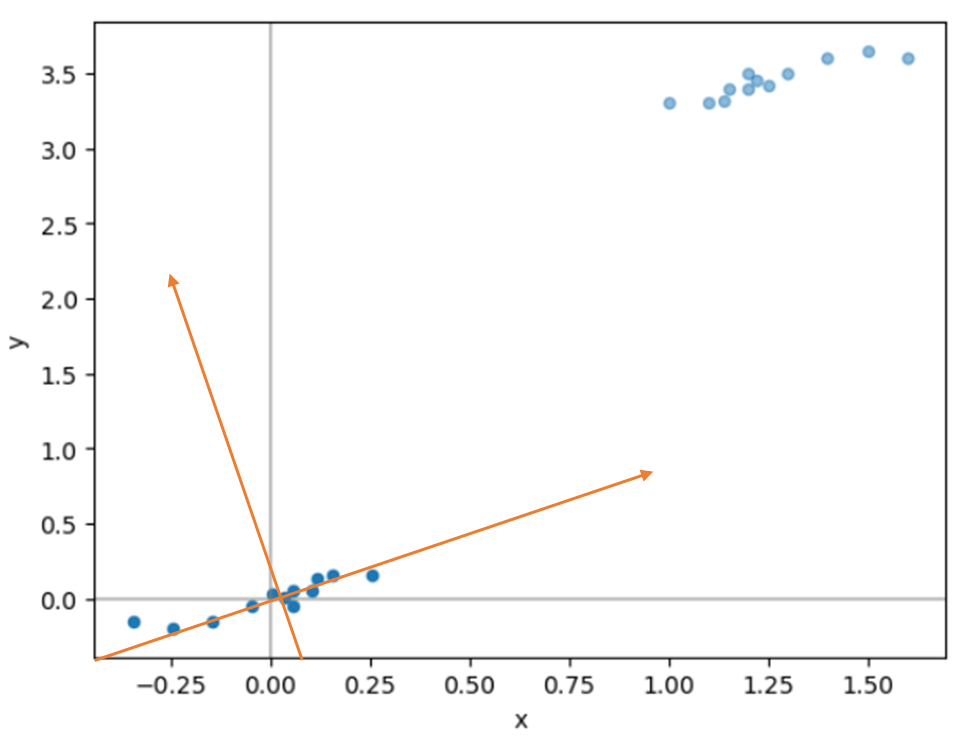

# Einführung in PCA

Die Idee von PCA ist es das Koordinatensystem des Raumes so zu transformieren,
dass die Dimensionen des Raums nach der Informationsfülle (der Varianz) der Daten
sortiert sind. Dann können nämlich spätere Achsen des Koordinatensystems weggelassen werden.
Dies sorgt dafür, dass die Komplexität der Daten verringert wird, aber gleichzeitig
nur wenig Informationen verloren gehen.

!!! beispiel "Merkmale haben verschiedenen Informationsgehalt"
    
    Du siehst hier Pullover mit verschiedenen Farben und Größen.
    
    Welche der beiden Eigenschaften hat eine größere Aussagekraft?

    Welche der beiden Eigenschaften hat die größere Varianz?

    

!!! beispiel "Projektion auf Achsen"
    
    Im einfachsten Fall könnte man sich anschauen, welche Varianz eine einzelnes Merkmal der Daten aufweist:

    ```python
    df = pd.DataFrame(
    {
        'x' : [1, 1.2, 1.3, 1.4, 1.5, 1.6, 1.1, 1.2, 1.15, 1.14, 1.25, 1.22],
        'y' : [3.3, 3.5, 3.5, 3.6, 3.65, 3.6, 3.3, 3.4, 3.4, 3.32, 3.42, 3.45],
    })
    ```
    
    **Datensatz:**

    
    
    **Projektion auf die x-Achse:**

    

    **Projektion auf die y-Achse:**

    

    Gesucht ist eine Achse, bei der die auf die Achse projezierten Punkte eine möglichst hohe Varianz behalten.

    **Projektion mit PCA:**

    

    **Verleich der drei Varianten:**

    

## Grobes Vorgehen

Bei PCA werden zunächst die Daten in die Mitte des Koordinatensystems verschoben.



Danach wird ein Projektionsvektor gefunden, bei dem die Daten eine größtmögliche Varianz behalten.


Die Informationen des gefunden Vektors können aus den Daten herausgerechnet werden.
Dann kann das Verfahren erneut angewandt werden, um den nächsten Vektor zu finden,
der senkrecht auf dem alten steht und die maximale Varianz bewahrt. Im zweidimensionalen Fall
ist da nicht viel zu tun, aber wenn z.B. 30 Dimensionen an Daten vorliegen, ist das nicht trivial.



**Der Knüller:** Die gesuchten Vektoren sind genau die Eigenvektoren der Kovarianzmatrix der Daten!
Das macht die ganze Berechnung sehr einfach und ist dazu noch faszinierend.

## Verständnisplan

* Was ist die Kovarianzmatrix?
* Wie projiziert man einen Punkt auf einen Vektor?
* Was ist ein Eigenvektor?
* Wie bestimmt man Eigenvektoren?
* Warum sind die Varianz maximierenden Vektoren genau die Eigenvektoren?

Wir werden feststellen, dass noch weitere Fragen relevant werden:

* Wie kann ich eine Funktion mit einer Nebenbedingung maximieren?
* Wie normalisiere ich einen Vektor?