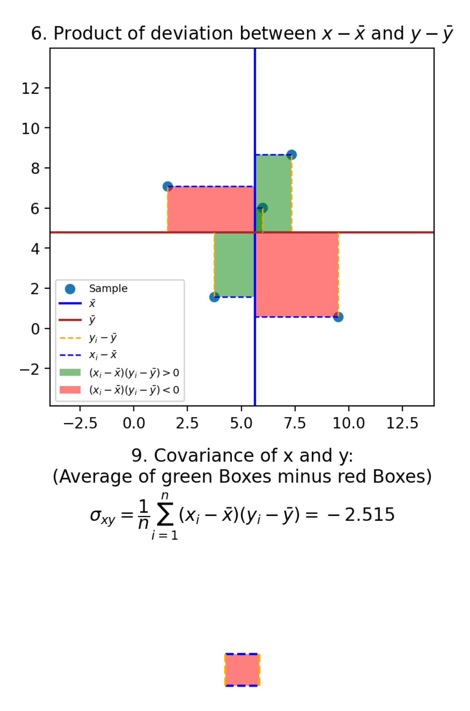

# Varianz maximieren

Wir haben gesehen, wie man einen Punkt auf einen Vektor projiziert.

Wir nutzen dies, um bei PCA ein neues Merkmal zu erzeugen. Alle unsere Daten werden auf einen Vektor
projiziert mit der Formel $pr_v(w)=kv$. im neuen Merkmal wird dann das $k$ als neues Merkmal gespeichert.

Nur wollen wir $v$ so wählen, dass die Varianz in dem neuen Merkmal möglichst groß ist.

Hier können wir ein paar Rechnungen durchführen, die wichtige Erkenntnisse liefern.

!!! formel "Wiederholung: Varianz"

    Sei $x = (x_1, \cdots , x_N) \in (\mathbb{R}^D)^N$ ein Datensatz aus $N$ Daten und $D$ Merkmalen.
    Dann ist die Varianz von $X$ definiert als:

    $$
    var(x) = \frac{1}{N} \sum_{i=1}^{N} (x_i - \bar{x})^2 
    $$

Angenommen wir haben nun einen Datensatz $x$ und einen Vektor $v$, auf den die Daten projiziert wurden.
Wir wollen dann in $k = (k_1, k_2, \cdots , k_N) \in \mathbb{R}^{N}$ die Faktoren die bei der Projektion
entstehen speichern. Wir wissen, dass $k_i = \frac{x_i^t v}{|v|^2} = \frac{v^t x_i}{|v|^2}$ gilt.

Berechnen wir nun $var(k)$:

\begin{align}
    var(k) &= \frac{1}{N} \sum_{i=1}^{N} (k_i - \bar{k})^2 \\
	&= \frac{1}{N} \sum_{i=1}^{N} \left( \frac{v^t x_i}{|v|^2} - \frac{v^t \bar{x}}{|v|^2} \right)^2 \\
	&= \frac{1}{N} \sum_{i=1}^{N} \left( \frac{1}{|v|^2} \left( v^t x_i - v^t \bar{x} \right) \right)^2 \\
	&= \frac{1}{N} \sum_{i=1}^{N} \left( \frac{1}{|v|^2} \right)^2 \left( v^t x_i - v^t \bar{x} \right)^2 \\
	&= \frac{1}{N} \sum_{i=1}^{N} \frac{1}{|v|^4} \left( v^t x_i - v^t \bar{x} \right)^2 \\
	&= \frac{1}{|v|^4}\cdot \frac{1}{N} \sum_{i=1}^{N} \left( v^t x_i - v^t \bar{x} \right)^2 \\
	&= \frac{1}{|v|^4}\cdot \frac{1}{N} \sum_{i=1}^{N} \left( v^t (x_i - \bar{x}) \right)^2 \\
	&= \frac{1}{|v|^4}\cdot \frac{1}{N} \sum_{i=1}^{N} \left( v^t (x_i - \bar{x}) \right)\left( v^t (x_i - \bar{x}) \right) \\
	&= \frac{1}{|v|^4}\cdot \frac{1}{N} \sum_{i=1}^{N} \left( v^t (x_i - \bar{x}) \right)\left( (x_i - \bar{x})^t v \right) \\
	&= \frac{1}{|v|^4} v^t \left( \frac{1}{N} \sum_{i=1}^{N} (x_i - \bar{x}) (x_i - \bar{x})^t \right) v \\
\end{align}

Und nun? Hier verbirgt sich ein Schatz, denn der Ausdruck $\frac{1}{N} \sum_{i=1}^{N} (x_i - \bar{x}) (x_i - \bar{x})^t$,
der hier so mühsam ausgeklammert wurde, ist etwas Besonderes, nämlich die geschlossene Form der **Kovarianzmatrix** $S$ von $x$!
Damit können wir die Gleichung zusammenfassen zu:

$$
var(k) = \frac{1}{|v|^4} v^t S v
$$

Wir werden gleich sehen, wie man die Kovarianzmatrix berechnet, doch ich versichere schonmal, dass dies ein großer Schritt
in Richtung unseres Zieles ist, einen Vektor $v$ zu finden, sodass $var(k)$ maximal ist.

{{ task("tasks/pca/varianz/projizierter_mittelwert.yaml") }}

## Kovarianz

!!! formel "Kovarianz"

	Es seien $x, y \in \mathbb{R}^N$ zwei Merkmale mit $N$ Ausprägungen.
	Die Kovarianz von $x$ und $y$ berechnet sich mit der Formel

	$$
	cov(x,y) = \frac{1}{N} \sum_{i=1}^N (x_i - \bar{x})(y_i - \bar{y}) 
	$$

	Oft wird die Notation $cov(x,y) = \sigma_{xy}$ verwendet.

!!! beispiel "Verbildlichung der Kovarianz"

	[📙Notebook mit ausführlicher Erklärung zur Kovarianz](https://www.kaggle.com/code/viktorreichert/tutorial-visualization-of-covariance-and-variance/notebook)

	

{{ task("tasks/pca/varianz/kovarianzen_ausrechnen.yaml") }}

{{ task("tasks/pca/varianz/mathematik_der_kovarianz.yaml") }}

{{ task("tasks/pca/varianz/kovarianz_programmieren.yaml") }}

## Kovarianzmatrix

!!! formel "Kovarianzmatrix"

    Es sei \( X \in \mathbb{R}^{N \times D} \) eine Datenmatrix mit \( N \) Beobachtungen und \( D \) Merkmalen.
	Es sei $X_i \in \mathbb{R}^N$ dabei das $i$-te Merkmal. 
    Die Einträge der **Kovarianzmatrix** \( S \) berechnen sich mit der Formel:

	$$
	S_{ij} = cov(X_i, X_j), \text{ für } i,j \in \{ 1, \cdots , M\}
	$$

	

{{ task("tasks/pca/varianz/kovarianzmatrix_ausrechnen.yaml") }}

{{ task("tasks/pca/varianz/closed_form.yaml") }}

{{ task("tasks/pca/varianz/kovarianzmatrix_alternativ_ausrechnen.yaml") }}

{{ task("tasks/pca/varianz/kovarianzmatrix_programmieren.yaml") }}

