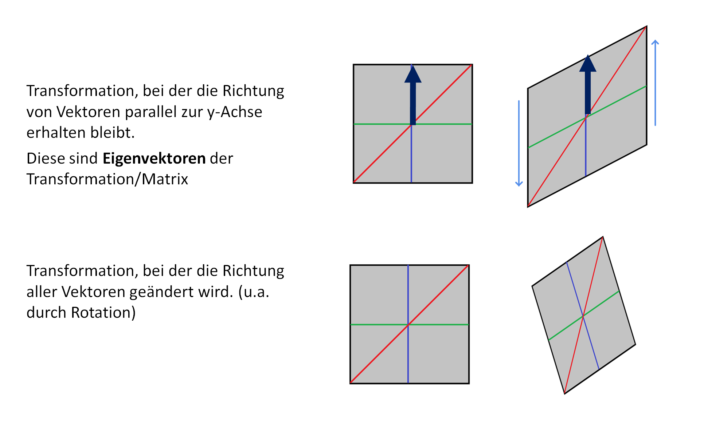
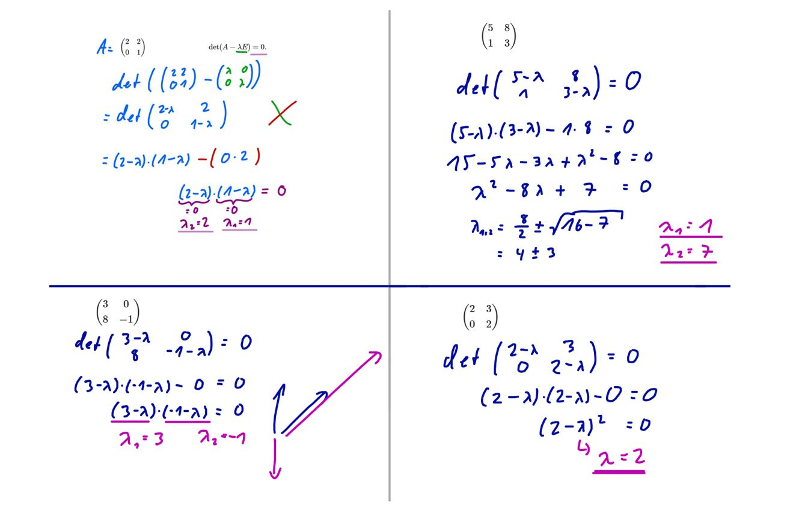
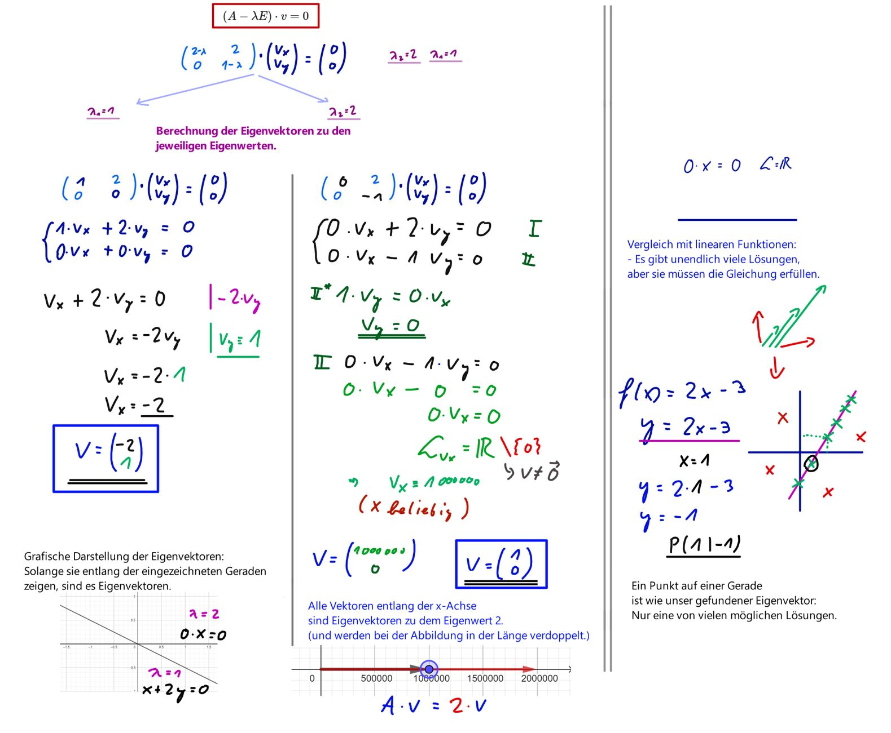
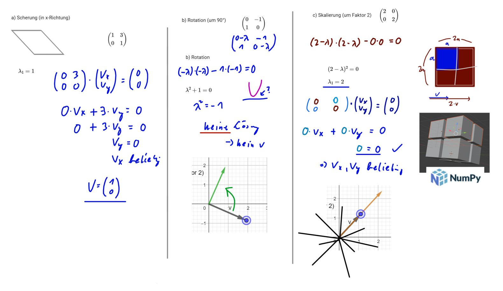

# Eigenvektoren und Eigenwerte

Die nächste zentrale Definition ist die von Eigenwerten und Eigenvektoren eines Endomorphismus eines Vektorraums.  

!!! formel "Eigenwert"
    Sei \( f: V \to V \) ein Endomorphismus. Ein \( \lambda \in K \) heißt **Eigenwert** von \( f \), wenn es einen Vektor \( v \neq 0 \) gibt mit \( f(v) = \lambda v \). 

 
Ein solcher Vektor heißt dann ein **Eigenvektor** von \( f \) zum Eigenwert \( \lambda \).

!!! formel "Eigenvektor"
    Ein Eigenvektor \( v \) bzgl. \( f \) ist ein Vektor, der nicht Null ist und der durch \( f \) um einen Faktor \( \lambda \), den Eigenwert, gestreckt wird.  
    Wir definieren:

    $$
    E(f, \lambda) = \{ v \in V \mid f(v) = \lambda v \}
    $$

    für alle \( \lambda \in K \).

Dies ist ein Untervektorraum von \( V \).  
Per Definition ist \( \lambda \in K \) ein Eigenwert von \( f \), wenn es einen Vektor \( v \neq 0 \) gibt, der zu \( E(f, \lambda) \) gehört.  
\( E(f, \lambda) = \{ v \in V \mid f(v) = \lambda v \} \) ist ein **Untervektorraum** von \( V \).

!!! beispiel "Bild zu Eigenvektoren"   
    

## Berechnen von Eigenwerten und Eigenvektoren

Nach Definition muss \( f(v) = \lambda v \) sein. Das bedeutet konkret (A ist eine Matrix):

$$
A v = \lambda v.
$$

Dies lässt sich auch umschreiben, mit \( E \) der Einheitsmatrix:

$$
A v = \lambda E v
$$

Das lässt sich dann umformen zu:

$$
(A - \lambda E)v = 0
$$

!!! formel "Bestimmung von Eigenwerten"
    Um nun den Eigenwert zu berechnen, löst man diese Gleichung.  
    Da \( v \neq 0 \) vorausgesetzt wird, folgt, dass es nur dann lösbar ist, wenn \( (A - \lambda E) \) einen nicht trivialen Kern hat (also keinen Kern \( \neq 0 \)).  
    Das bedeutet wiederum, dass die Determinante 0 sein muss:

    $$
    \det(A - \lambda E) = 0.
    $$

    Diese Determinante nennt man das **charakteristische Polynom**. Die Nullstellen dieses Polynoms sind die Eigenwerte.

!!! formel "Bestimmung von Eigenvektoren"
    Zur Bestimmung der Eigenvektoren setzt man den Eigenvektor in die Gleichung:

    $$
    (A - \lambda E)v = 0
    $$

    ein, anstelle des \( \lambda \), und erhält so ein Gleichungssystem, das man lösen kann.  
    Die Lösung dieses Gleichungssystems ist dann der **Eigenvektor** bzw. die **Eigenvektoren**.

<iframe src="https://www.geogebra.org/classic/j42zmkgz?embed" width="800" height="600" allowfullscreen style="border: 1px solid #e4e4e4;border-radius: 4px;" frameborder="0"></iframe>

!!! beispiel "Beispiel: Bestimmung von Eigenwerten"
    Wir bestimmen mal die Eigenwerte der folgenden Matrix:

    $$
    A =
    \begin{pmatrix}
    0 & 2 & -1 \\
    2 & -1 & 1 \\
    2 & -1 & 3
    \end{pmatrix}
    $$

    Setzt man diese in die Gleichung \( (A - \lambda E) = 0 \) ein, dann erhaltet ihr:

    $$
    A - \lambda E =
    \begin{pmatrix}
    0 - \lambda & 2 & -1 \\
    2 & -1 - \lambda & 1 \\
    2 & -1 & 3 - \lambda
    \end{pmatrix}
    =0
    $$

    Dann berechnet ihr die **Determinante** dazu:

    \[
    \begin{aligned}
    \det(A - \lambda E) &=
    (0 - \lambda)(-1 - \lambda)(3 - \lambda) + 4 + 2 - (2\lambda + 2 + \lambda + 12 - 4\lambda) \\
    &= -\lambda^3 + 2\lambda^2 + 4\lambda - 8 \\
    &= -(\lambda - 2)(\lambda - 2)(\lambda + 2) = 0
    \end{aligned}
    \]

    Die Nullstellen des Polynoms sind dann die **Eigenwerte**.  
    Also in diesem Fall \( \lambda_{1,2} = 2 \) und \( \lambda_3 = -2 \).

!!! beispiel "Beispiel: Bestimmung von Eigenvektoren"
    Jetzt geht es weiter mit den Eigenvektoren. Dazu setzen wir die Eigenwerte für \( \lambda \) ein, zuerst \( \lambda = 2 \):

    $$
    A - 2E =
    \begin{pmatrix}
    0 - 2 & 2 & -1 \\
    2 & -1 - 2 & 1 \\
    2 & -1 & 3 - 2
    \end{pmatrix}
    =
    \begin{pmatrix}
    -2 & 2 & -1 \\
    2 & -3 & 1 \\
    2 & -1 & 1
    \end{pmatrix}
    $$

    Dann muss man das folgende **Gleichungssystem lösen**: 

    $$
    (A - \lambda E) \cdot v = 0
    $$

    $$
    (A - 2 E) \cdot v_{2} = 0
    $$

    $$
    \begin{pmatrix}
    -2 & 2 & -1 \\
    2 & -3 & 1 \\
    2 & -1 & 1
    \end{pmatrix}
    \cdot
    v_{2} =
    \begin{pmatrix}
    0 \\
    0 \\
    0
    \end{pmatrix}
    $$

    Man erhält durch Umformung: (z.B. Gauß-Jordan-Algorithmus)

    $$
    \begin{pmatrix}
    1 & 0 & \frac{1}{2} \\
    0 & 1 & 0 \\
    0 & 0 & 0
    \end{pmatrix}
    \cdot
    v_{2} =
    \begin{pmatrix}
    0 \\
    0 \\
    0
    \end{pmatrix}
    $$

    Dadurch ergibt sich dieses Gleichungssystem:

    $$
    1 \cdot v_{2,1} + \frac{1}{2} \cdot v_{2,3} = 0 
    \Rightarrow
    v_{2,1} = - \frac{1}{2} \cdot v_{2,3}
    $$

    $$
    1 \cdot v_{2,2} = 0
    $$
 

    Als möglicher Vektor lässt sich so ablesen:

    $$
    v_{2} =
    \begin{pmatrix}
    \frac{1}{2} \\
    0 \\
    -1
    \end{pmatrix}
    $$

    Die **Eigenvektoren** sind dann **alle Vielfachen** dieses Vektors!

    **Für den Eigenwert \( -2 \) macht ihr das genauso:**

    $$
    A - (-2)E = A + 2E =
    \begin{pmatrix}
    0 + 2 & 2 & -1 \\
    2 & -1 + 2 & 1 \\
    2 & -1 & 3 + 2
    \end{pmatrix}
        =
    \begin{pmatrix}
    2 & 2 & -1 \\
    2 & 1 & 1 \\
    2 & -1 & 5
    \end{pmatrix}
    $$

    $$
    \begin{pmatrix}
    2 & 2 & -1 \\
    2 & 1 & 1 \\
    2 & -1 & 5
    \end{pmatrix}
    \cdot
    v_{-2} =
    \begin{pmatrix}
    0 \\
    0 \\
    0
    \end{pmatrix}
    $$

    So erhaltet ihr den zweiten Eigenvektor, nämlich **alle Vielfachen** des Vektors:

    $$
    v_{-2} =
    \begin{pmatrix}
    \frac{3}{2} \\
    -2 \\
    -1
    \end{pmatrix}
    $$

## Aufgaben zu Eigenwerten und Eigenvektoren

{{ task(file="tasks/pca/eigenvektor/AufgabeEV1.yaml") }}

{{ task(file="tasks/pca/eigenvektor/AufgabeEV2.yaml") }}

{{ task(file="tasks/pca/eigenvektor/AufgabeEV3.yaml") }}

{{ task(file="tasks/pca/eigenvektor/AufgabeEV0_program.yaml") }}

## Begriffe und charakteristisches Polynom

!!! Info "Kurze Übersicht/Wiederholung wichtiger Begriffe für die Herleitung"

    **Determinante:** Gibt an, wie sich das Volumen bei der durch die Matrix beschriebenen linearen Abbildung ändert.

    **Eigenvektor:** Der Eigenvektor einer Abbildung ist ein vom Nullvektor verschiedener Vektor, dessen Richtung durch die Abbildung nicht verändert wird.

    Sonderfall: Für reelle **symmetrische** Matrizen gilt: Die Eigenvektoren zu verschiedenen Eigenwerten sind zueinander **orthogonal**.

    **Eigenwert:** Der Eigenwert ist der Skalierungsfaktor eines Eigenvektors.

    **injektiv:** Eine Funktion ist injektiv, wenn es zu jedem Element y
    der Zielmenge Y höchstens ein Element x der Ausgangs- oder Definitionsmenge X gibt, das darauf abgebildet wird.

    **invertierbar:**  Eine Funktion ist genau dann invertierbar , wenn sie bijektiv (also gleichzeitig injektiv und surjektiv) ist.
    Eine quadratische Matrix ist genau dann invertierbar, wenn ihre Determinante ungleich null ist.

!!! tip "Herleitung: Eigenwerte \(\lambda\) erfüllen \( \det(\lambda E - A) = 0 \)"
    
    Das charakteristische Polynom ( \( \det(\lambda E - A) \) ) spielt eine wichtige Rolle bei der Bestimmung der Eigenwerte einer Matrix, denn die Eigenwerte sind genau die Nullstellen des charakteristischen Polynoms. Auch wenn man zum expliziten Berechnen des charakteristischen Polynoms immer eine Basis und damit eine Darstellungsmatrix auswählt, hängen das Polynom wie auch die Determinante nicht von dieser Wahl ab.

    Um zu zeigen, dass die Eigenwerte gerade die Nullstellen des charakteristischen Polynoms sind, geht man folgendermaßen vor:

    Es sei \(\lambda \in \mathbb{K}\) und \(A\) eine \(n \times n\)-Matrix über \(\mathbb{K}\). Dann gelten die folgenden Äquivalenzen:

    \[
    \lambda \text{ ist ein Eigenwert von } A 
    \]

    \[
    \iff \exists x \in \mathbb{K}^n, x \neq 0 \text{ mit } A x = \lambda x
    \]

    \[
    \iff \exists x \in \mathbb{K}^n, x \neq 0 \text{ mit } (\lambda E - A) x = 0
    \]

    \[
    \iff \text{Der Kern von } \lambda E - A \text{ besteht nicht nur aus dem Nullvektor, d.h. } \ker(\lambda E - A) \neq \{ 0 \}
    \]

    \[
    \text{(D.h., andere Vektoren als der Nullvektor werden auf den Nullvektor abgebildet.)}
    \]

    \[
    \iff \text{Die durch } \lambda E - A \text{ induzierte lineare Abbildung ist nicht injektiv}
    \]

    \[progra
    \iff \lambda E - A \text{ ist nicht invertierbar}
    \]

    \[
    \iff \det(\lambda E - A) = 0
    \]

    \[
    \iff \lambda \text{ ist Nullstelle des charakteristischen Polynoms von } A
    \]

<iframe src="https://www.geogebra.org/classic/e8kydrx9?embed" width="800" height="600" allowfullscreen style="border: 1px solid #e4e4e4;border-radius: 4px;" frameborder="0"></iframe>

## Orthogonale Eigenvektoren

!!! tip "Herleitung: Eigenvektoren von symmetrischen Matrizen sind orthogonal"

    Für zwei **verschiedene** Eigenvektoren $v$ und $w$ mit den Eigenwerten $\lambda$ und $\mu$ gilt:

    \[
    A v = \lambda v, \quad A w = \mu w.
    \]

    Wenn $A$ symmetrisch (d.h. $A = A^t$) ist, folgt:

    \[
    \begin{array}{rrl}
    & A^t &=& A \\
    \Leftrightarrow & v^t A^t &=& v^t A \\
    \Leftrightarrow & v^t A^t w &=& v^t A w \\
    \Leftrightarrow & (A v)^t w &=& v^t A w \\
    \Leftrightarrow & (\lambda v)^t w &=& v^t \mu w \\
    \Leftrightarrow & \lambda v^t w &=&  \mu v^t w \\
    \Leftrightarrow & \lambda v^t w - \mu v^t w &=& 0 \\
    \Leftrightarrow & (\lambda- \mu) v^t w  &=& 0 \\
    \Leftrightarrow & v^t w  &=& 0 \\
    \Leftrightarrow & v &\perp& w
    \end{array}
    \]

    Da $\lambda \neq \mu$, muss $v^t w = 0$ sein. Das ist dann $v \perp w$. 

{{ task(file="tasks/pca/eigenvektor/AufgabeEV4.yaml") }}

{{ task(file="tasks/pca/eigenvektor/AufgabeEV5.yaml") }}

## Mitschriften

!!! beispiel "Eigenwerte berechnen (Aufgabe 1)"   
    

!!! beispiel "Eigenvektoren berechnen (Aufgabe 1a)"   
    

!!! beispiel "Eigenvektoren - Sonderfälle (Aufabe 2)"   
    